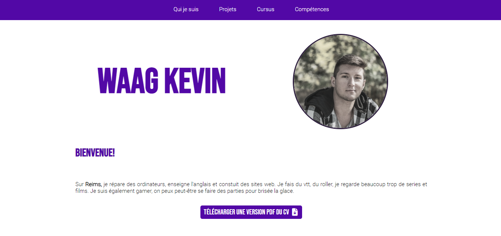
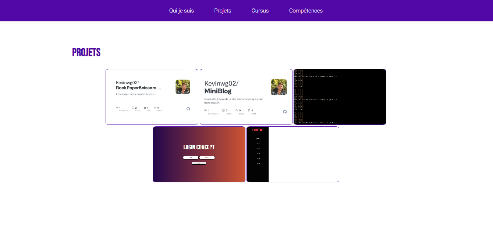
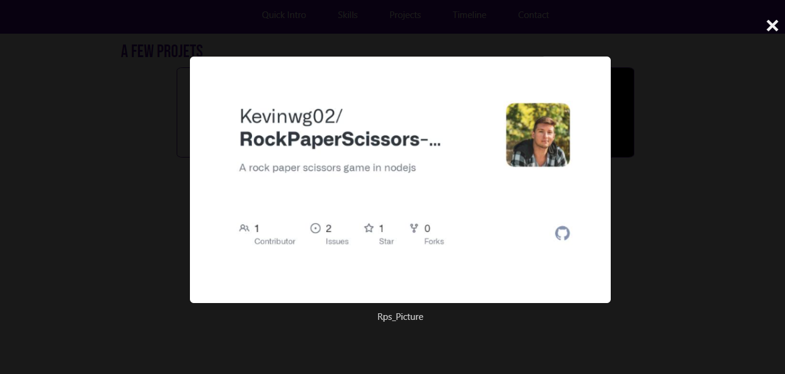
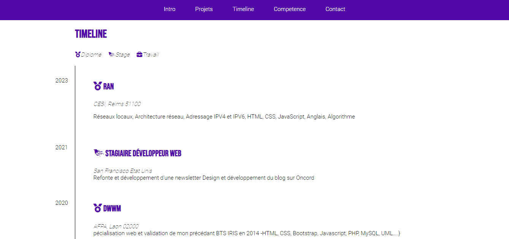
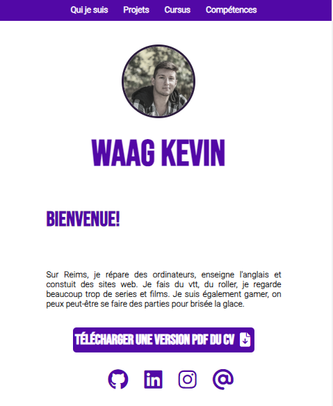
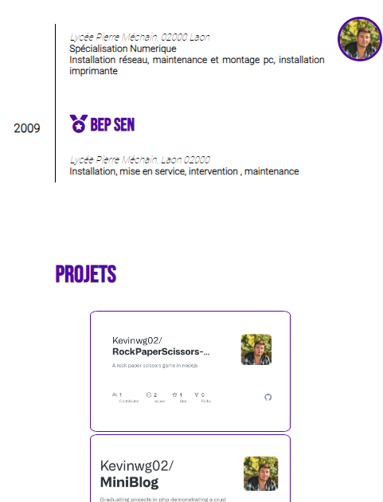

# kevinwg02.github.io

This is a very simplistic, version 09.23 ,of my resume.  
</img>
The menu sticks to the top of the page when you scroll down.
The pictures opens in a modal to appear bigger.

</img>
</img>

Here is a little timeline of my life
</img>

The responsive is quit fun, with the main picture slowing getting smaller with animation
</img>

the menu disappears by simply turning white my head is what makes the menu appear ^^  
</img>
